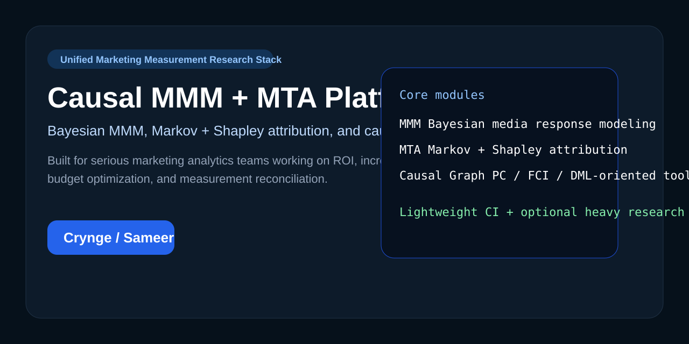

# Causal MMM + MTA Platform

[](https://python.org)
[](LICENSE)
[](https://github.com/Crynge/causal-mmm-mta-platform/actions/workflows/ci.yml)
[](https://github.com/Crynge/causal-mmm-mta-platform/actions/workflows/repo-health.yml)



Unified **marketing measurement research platform** for teams working across **Bayesian Marketing Mix Modeling (MMM)**, **Multi-Touch Attribution (MTA)**, and **causal inference**. The repository packages practical modeling primitives for channel contribution analysis, attribution path analysis, and causal graph discovery without pretending to already be a full hosted SaaS product.

## What this repository is

This repo is best suited for:

- data scientists building custom MMM pipelines
- marketing analytics teams evaluating attribution frameworks
- consultants comparing Bayesian MMM, Markov attribution, and Shapley attribution
- researchers exploring causal graph discovery in media measurement

## Current implementation surface

### `mmm/`

- hierarchical Bayesian MMM scaffolding
- adstock transforms
- saturation curves
- seasonal feature generation

### `mta/`

- Markov chain attribution
- Shapley-value attribution
- path sessionization
- attribution result comparison helpers

### `causal_graph/`

- PC-style skeleton discovery
- FCI-oriented discovery entrypoint
- domain knowledge constraints
- causal effect and DML hooks with optional dependencies

## Honest scope

The repo currently ships **core modeling modules and reference implementations**. It does **not** yet include the fully operational ingestion, dashboard, API, orchestration, and experimentation surfaces described in a few older README sections. Those roadmap ambitions are now documented more clearly instead of being implied as already complete.

## Public docs

- [Architecture notes](./docs/architecture.md)
- [Final audit](./docs/final-audit.md)
- [Security policy](./SECURITY.md)
- [Contributing guide](./CONTRIBUTING.md)
- [Authors](./AUTHORS.md)

## Quick start

### Lightweight local verification

If you want to inspect the repo, run tests, and work on the attribution/core logic first:

```bash
git clone https://github.com/Crynge/causal-mmm-mta-platform.git
cd causal-mmm-mta-platform
python -m venv venv
venv\Scripts\activate
pip install -r requirements-core.txt
python -m pytest tests -q
```

### Full research stack

If you want the full MMM and causal inference surface:

```bash
pip install -r requirements.txt
```

That path brings in heavier optional dependencies such as PyMC, ArviZ, DoWhy, EconML, Spark, and orchestration tooling.

## Why this repo is useful

- It creates one place to compare **MMM**, **MTA**, and **causal discovery** in the same workflow.
- It is easier to extend than vendor-locked measurement stacks.
- It provides a clearer starting point for building **unified marketing measurement** and **incrementality analysis** tooling.

## Repository structure

```text
causal-mmm-mta-platform/
├── mmm/
├── mta/
├── causal_graph/
├── tests/
├── docs/
└── .github/
```

## Verification

Current verification is documented in [docs/final-audit.md](./docs/final-audit.md) and includes:

- import-smoke coverage for optional dependency boundaries
- attribution path logic checks
- config validation checks
- repository health workflow checks

## GitHub discoverability

Recommended metadata for GitHub search ranking is included in:

- [`.github/DESCRIPTION.md`](./.github/DESCRIPTION.md)
- [`.github/TOPICS.md`](./.github/TOPICS.md)
- [`.github/SEO_KEYWORDS.md`](./.github/SEO_KEYWORDS.md)

Core discovery phrases this repo now targets naturally:

- Bayesian marketing mix modeling
- multi-touch attribution Python
- causal inference for marketing analytics
- unified marketing measurement
- Markov attribution and Shapley attribution
- incrementality measurement platform

## Maintainer

Built and maintained by **Sameer Alam**. See [AUTHORS.md](./AUTHORS.md).
